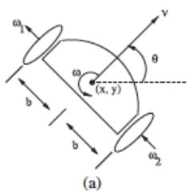
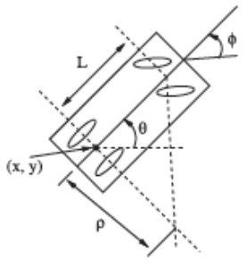
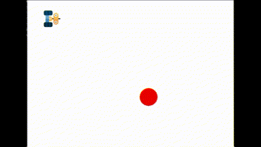
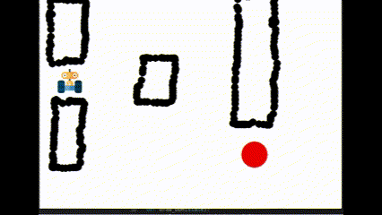
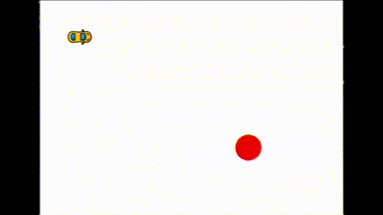
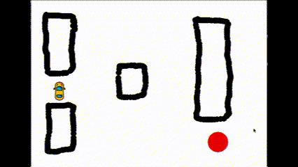

# Rapidly exploring Random Tree (RRT) on Non-holonomic Systems

Path planning is a classical problem in robotics where a robot travels from a configuration $A$ to a configuration $B$ avoiding a set of obstacles in the environment, $\mathcal{C}_{obs}$. One way to solve this problem is using [Rapidly exploring Random Trees](https://msl.cs.illinois.edu/~lavalle/papers/Lav98c.pdf) or RRT for short where a graph and a trajectory are generated by connecting nodes in the graph.

In this project, RRT algorithm is implemented in simulation for path planning on non-holonomic systems in a 2-dimensional cartesian configuration space. The systems used are a differential drive robot (DDR) and a car-like robot.

  

The implementation uses pygame to visualize the results on environments with and without obstacles as we can see below. For each robot configuration go to [DDR](./DDR/) or [Car-like robot](./Car-like%20robot/) folder.

  

  

Full detailed project can be found on [this file](Tarea_1_Marco_Esquivel.pdf) even thought it is written in Spanish.
